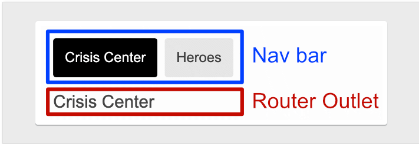
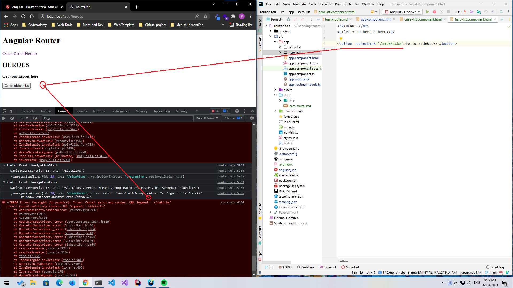
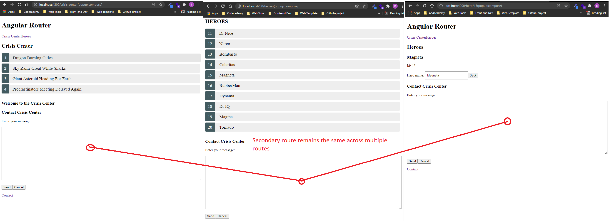
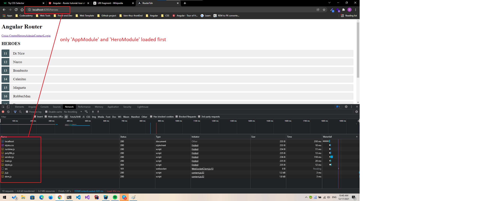
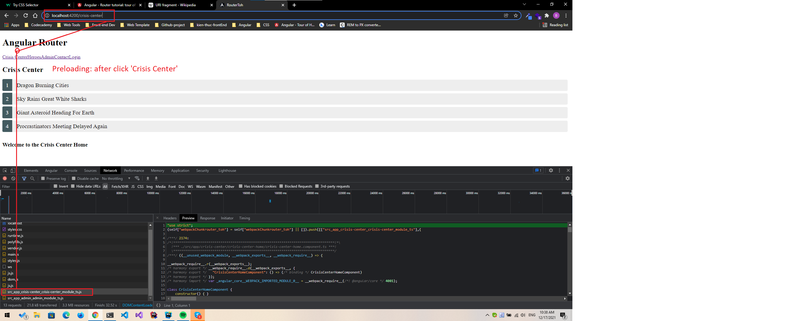
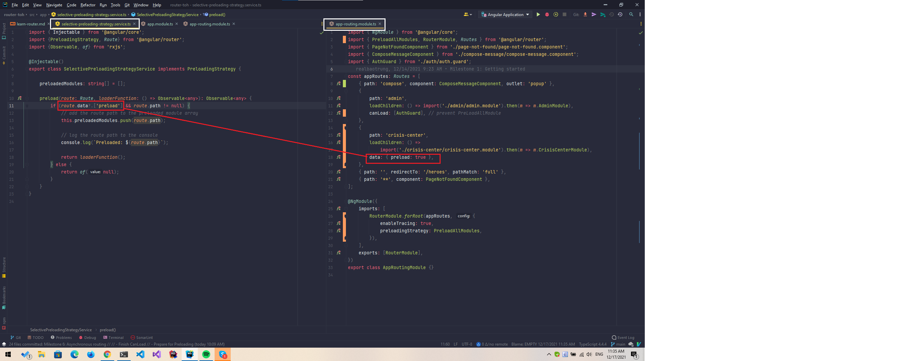

# Router tutorial: tour of heroes

## Objectives

-   Organizing the application features into modules.
-   Navigating to a component (Heroes link to "Heroes LIst").
-   Including a route parameter (passing the Hero `id` while routing to the "Hero Detail").
-   Child routes ( the Crisis Center has its own routes).
-   The `CanActivate` guard (checking route access).
-   The `CanActivateChild` guard (checking child route access).
-   The `CanDeactivate` guard (ask permission to discard unsaved changes).
-   The `Resolve` guard (pre-fetching route data).
-   Lazy loading an `NgModule`.
-   The `CanLoad` guard (check before loading feature module assets).

## Milestone 1 : Getting started

### Add the Router Outlet



`<router-outlet>` serves as a placeholder where the routed components are rendered.

### Define a Wildcard route

You have defined 2 routes: `/crisis-center` and `/heroes`. Any other URL causes the router to throw an error and crash
the app.

**Error occurs when routerLink does not exist.**



### Set up redirects

### Summary

-   Load the router library
-   Add a nav bar to the shell template with anchor tags, `routerLink` and `routerLinkActive` directives
-   Add a `router-outlet` to the shell template where views are displayed.
-   Configure the router module with `RouterModule.forRoot()`.
-   Set the router to compose HTML5 browser URLs.
-   handle invalid routes with a `wildcard` route.
-   Navigate to the default route when the application launches with an empty path.

## Milestone 2: Routing module

Routing Module has several characteristics:

-   Separates routing concerns from other application concerns.
-   Provides a module to replace or remove when testing the application.
-   Provides a well-known location for routing service providers such as guards and resolvers.
-   Does not declare components.

### Integrate routing with your app

With `--routing` option, you can create a project that does use routing.

```shell
ng generate module app-routing --module app --flat
```

To create an `AppRoutingModule` module in the `/app` folder to contain the routing configuration.

## Milestone 3: Heroes feature

This milestone covers the following:

-   Organizing the application and routes into feature areas using modules.
-   Navigating imperatively from one component to another.
-   Passing required and optional information in route parameters.

> A typical application has multiple feature areas, each dedicated to a particular business purpose with its own folder.

### Add heroes functionality

To manage the heroes, create a `HeroesModule` with routing in the heroes folder and register it with the
root `AppModule`

```shell
ng generate module heroes/heroes --module app --flat --routing
```

This command does things:

-   Create: `app/heroes/heroes.module.ts`
-   Create: `app/heroes/heroes-routing.module.ts`
-   Update: `app/app.module.ts`

#### Hero feature routing requirements

> Only call `RouterModule.forRoot()` in the root `AppRoutingModule`. In any other module, you must call the `RouterModule.forChild()` method to register additional routes.

### Module import order

```shell
# src/app/app.module.ts

imports: [
  BrowserModule,
  FormsModule,
  HeroesModule,     #The order is very important!!!
  AppRoutingModule  #if AppRoutingModule is placed front of HeroesModule
                    #by the effect of `**` wildcard routes,
                    #you are navigated to `Page not found`
],
```

When all routes were in one `AppRoutingModule`, you put the default and `wildcard routes` last, after the `/heroes`
route, so that the router had a chance to match a URL to the `/heroes` route before hitting the wildcard route and
navigating to **"Page not found"**.

### Route Parameters

```shell
# src/app/heroes/heroes-routing.module.ts
{ path: 'hero/:id', component: HeroDetailComponent }
```

The `:id` token creates a slot in the path for a Route Parameter. In this case, this configuration causes the router
to **insert the id of a hero into that slot**.

```shell
localhost:4200/hero/15
```

#### Setting the route parameters in the list view

```shell
# src/app/heroes/hero-list/hero-list.component.html
<a [routerLink]="['/hero', hero.id]">
```

link parameter `[routerLink]` has 2 items:

-   routing path: `'/hero'`
-   route parameter: `hero.id`

for example: we have `localhost:4200/hero/15`, the router extracts the route parameter `id: 15` from the URL and
supplies it to the `HeroDetailComponent` using the `ActivatedRoute` service

### Activated Route in action

```shell
import { Router, ActivatedRoute, ParamMap } from '@angular/router';
import { switchMap } from 'rxjs/operators';

hero$: Observable<Hero>;

constructor(
  private route: ActivatedRoute,
  private router: Router,
  private service: HeroService
) {}
```

```shell
# src/app/heroes/hero-detail/hero-detail.component.ts
ngOnInit() {
  this.hero$ = this.route.paramMap.pipe(
    switchMap((params: ParamMap) =>
      this.service.getHero(params.get('id')!))
  );
}
```

`ngOnInit()` use the `ActivateRoute` service to retrieve route parameter, pull hero `id` from the parameters, and
retrieve the hero to display

-   when the map changes, `paramMap` get `id` parameter from the changed parameters.
-   then tell `HeroSerice` to fetch hero with that `id` and return the result of `HeroService` request.
-   `switchMap` operator does 2 things:
    -   it flattens the `Observable<Hero>` that `HeroService` returns.
    -   cancels previous pending requests.

We have 2 things:

-   `ActivatedRoute.paramMap` and component reuse (here is `HeroDetailComponent`), the router re-uses a component instance
    when it re-navigates to the same component. The route parameters could change each time.
-   `ActivatedRoute.snapshot` won't reuse component, the router creates a new `HeroDetailComponent` instance each time.
    There is no way to navigate from one hero detail to another hero detail without visiting the list component in
    between.

```shell
# src/app/heroes/hero-detail/hero-detail.component.ts
ngOnInit() {
  this.hero$ = this.route.paramMap.pipe(
    switchMap((params: ParamMap) =>
      this.service.getHero(params.get('id')!))
  );
}
```

```shell
# src/app/heroes/hero-detail/hero-detail.component.ts
ngOnInit() {
  const id = this.route.snapshot.paramMap.get('id')!;
  this.hero$ = this.service.getHero(id);
}
```

> `snapshot` only gets the initial value of the parameter map. Use the observable `paramMap` approach if there's a possibility that the router could re-use the component.

### Navigating back to the list component

`HeroDetailComponent` "back" button uses the `gotoHeroes()` method that navigates back to `HeroListComponent`

### Route parameters in the ActivatedRoute service

```shell
# src/app/heroes/hero-list/hero-list.component.ts
ngOnInit() {
this.heroes$ = this.route.paramMap.pipe(
  switchMap(params => {
    this.selectedId = parseInt(params.get('id')!, 10);
    return this.service.getHeroes();
  })
);
}
```

### Adding routable animations

```shell
# src/app/app.module.ts
import { BrowserAnimationsModule } from '@angular/platform-browser/animations';

@NgModule({
  imports: [
    BrowserAnimationsModule,
  ],
})
```

```shell
# src/app/heroes/heroes-routing.module.ts
const heroesRoutes: Routes = [
  { path: 'heroes',  component: HeroListComponent, data: { animation: 'heroes' } },
  { path: 'hero/:id', component: HeroDetailComponent, data: { animation: 'hero' } }
];
```

Create `src/app/animation.ts`

update in `app.component`

```shell
# src/app/app.component.ts
export class AppComponent {
    title = 'router-toh';

    getAnimationData(outlet: RouterOutlet) {
        return outlet?.activatedRouteData?.['animation'];
    }
}
```

```shell
# src/app/app.component.html
<div [@routeAnimation]='getAnimationData(routerOutlet)'>
    <router-outlet #routerOutlet='outlet'></router-outlet>
</div>
```

### Summary

This section covered the following:

-   Organizing the application into feature areas.
-   Navigating imperatively from one component to another.
-   Passing information along in route parameters and subscribe to them in the component.
-   Importing the feature area NgModule into the AppModule.
-   Applying routable animations based on the page.

## Milestone 4: Crisis center feature

### A crisis center with child routes

Recommended pattern for Angular applications:

-   Each feature area resides in its own folder.
-   Each feature has its own Angular feature module.
-   Each area has its own area root component.
-   Each area root component has its own router outlet and child routes.
-   Feature area routes rarely cross with routes of other features.

### Child routing component

### Child route configuration

```shell
# src/app/crisis-center/crisis-center-routing.module.ts
const crisisCenterRoutes: Routes = [
  {
    path: 'crisis-center',
    component: CrisisCenterComponent,
    children: [
      {
        path: '',
        component: CrisisListComponent,
        children: [
          {
            path: ':id',
            component: CrisisDetailComponent
          },
          {
            path: '',
            component: CrisisCenterHomeComponent
          }
        ]
      }
    ]
  }
];
```

### Navigate to crisis list with a relative URL

```shell
# crisis-detail.component.ts

gotoCrises() {
    const crisisId = this.crisis ? this.crisis.id : null;
    # Pass along the crisis id if available
    # so that the CrisisListComponent can select that crisis.
    # Add a totally useless `foo` parameter for kicks.
    # Relative navigation back to the crises

    # if the current `id: 3`, the resulting path back to the CrisisList is
    # `/crisis-center/;id=3;foo=foo`

    # with `relativeTo: this.route`, the router then calculates the target URL
    # based on the active route's location.

    this.router.navigate(['../', { id: crisisId, foo: 'foo' }], { relativeTo: this.route });
}
```

### Displaying multiple routes in named outlets

```shell
# src/app/app.component.html
<div [@routeAnimation]="getAnimationData(routerOutlet)">
  <router-outlet #routerOutlet="outlet"></router-outlet>
</div>
<router-outlet name="popup"></router-outlet> # Secondary routes
```

#### Secondary routes

Secondary routes differ Primary routes in a few key respects:

-   They are independent of each other.
-   They work in combination with other routes.
-   They are displayed in named outlets.

```shell
ng generate component compose-message
```

Update `compose-message.component`

Notice:

```shell
# compose-message.component.ts
 send() {
    this.sending = true;
    this.details = 'Sending Message...';
    setTimeout(() => {
      this.sending = false;
      this.closePopup();
    }, 1000);
  }

  closePopup() {
    this.router.navigate([{ outlets: { popup: null }}]);
  }
```

-   `send()` simulates latency by waiting one second before "sending" the message and closing the popup.
-   `closePopup()` closes the popup view by navigating to the popup outlet with a `null`

#### Add a secondary route

Update `AppRoutingModule`



## Milestone 5: Route guards

Any user can navigate anywhere in the application any time, but sometimes you need to control access to different parts of you application for various reason:

-   Perhaps the user is not authorized to navigate to the target component.
-   Maybe the user must log in (authenticate) first.
-   Maybe you should fetch some data before you display the target component.
-   You might want to save pending changes before leaving a component.
-   You might ask the user if it's OK to discard pending changes rather than save them.

You add guards to the route configuration to handle these scenarios.

A guard's return value controls the router's behaviour:

-   if return `true`, the navigation process continues.
-   if return `false`, the navigation process stops and the user stays put.
-   if return `UrlTree`, the current navigation cancels, and a new navigations is initiated to the `UrlTree` returned.

The guard might return its boolean answer synchronously. But in many cases, These are all asynchronous operations.

A Routing guard can return an `Observable<boolean>` and the router will wait for the observable to resolve to `true` or `false`.

> Note: the observable provided to the `Router` must also complete. if the observable does not complete, the navigation does not continue.

The router supports multiple guard interfaces:

-   `CanActivate` to mediate navigation to a route.
-   `CanActivateChild` to mediate navigation to a child route.
-   `CanDeactivate` to mediate navigation away from the current route.
-   `Resolve` to perform route data retrieval before route activation.
-   `CanLoad` to mediate navigation to a feature module loaded asynchronously.

You can have multiple guards at every level of a routing hierarchy:

-   The router checks the `CanDeactivate` guards first, from **the deepest child route to the top**.
-   Then it checks the `CanActivate` and `CanActivateChild` guards, from **the top down to the deepest child route**.
-   If the feature module is loaded asynchronously, the `CanLoad` guard is checked before the module is loaded.
-   If any guard returns false, pending guards that have not completed are canceled, and the entire navigation is canceled.

### CanActivate: requiring authentication

You could permit access only to authenticated users or to users with a specific role. You might block or limit access until the user's account is activated.

#### Add an admin feature module

```shell
ng generate module admin --routing

ng generate component admin/admin-dashboard

ng generate component admin/admin

ng generate component admin/manage-crises

ng generate component admin/manage-heroes
```

#### Component-less route: grouping routes without a component

```shell
 path: 'admin',
    component: AdminComponent,
    children: [
      {
        path: '',
        children: [
          { path: 'crises', component: ManageCrisesComponent },
          { path: 'heroes', component: ManageHeroesComponent },
          { path: '', component: AdminDashboardComponent }
        ]
      }
    ]
  }
```

The child route under the `AdminComponent` has a path and a children property, but it's not using a component. This defines a **component-less route**.

#### Guard the admin feature

-   The new admin feature should be accessible only to authenticated users.
-   Write a `canActivate()` guard method to redirect anonymous users to the login page, when they try to enter the admin area.

```shell
ng generate guard auth/auth
```

Update `auth/auth.guard.ts`

Update `admin/admin-routing.module.ts`

#### Authenticate with AuthGuard

The `AuthGuard` should call an application service that can log in a user, and retain information about the current user.

```shell
ng generate service auth/auth
```

Update `auth/auth.service.ts`

```ts
import { Injectable } from '@angular/core';

import { Observable, of } from 'rxjs';
import { tap, delay } from 'rxjs/operators';

@Injectable({
  providedIn: 'root',
})
export class AuthService {
  isLoggedIn = false;

  // store the URL so we can redirect after logging in
  redirectUrl: string | null = null;

  login(): Observable<boolean> {
    return of(true).pipe(
      delay(1000),
      tap(() => this.isLoggedIn = true)
    );
  }

  logout(): void {
    this.isLoggedIn = false;
  }
}
```

-   `isLogggedIn` flag tell you whether the user is authenticated.
-   Its `login()` method simulates an API call to an external service.
-   The `redirectUrl` property stores the URL that the user wanted to access, so you can navigate to it after authentication.

Revise the `AuthGuard` to call `AuthService`

-   This guard returns a synchronous boolean result. If the user is logged in, it returns true and the navigation continues.
-   If the user is not logged in, you store the attempted URL the user came from using the `RouterStateSnapshot.url` and tell the router to redirect to a login page.
-   Returning a `UrlTree` tells the `Router` to cancel the current navigation and schedule a new one to redirect the user.

#### Add the LoginComponent

```shell
ng generate component auth/login

ng generate module auth/auth --routing
```

Update `app.module.ts`
Update `auth.module.ts`
Update `login.component`

### CanActivateChild: guarding child routes

`CanActivateChild` differs from `CanActivate` is that it runs before any child route is activated.

Update `auth.guard.ts` that implements `canActivateChild()`

```shell
# auth.guard.ts
canActivateChild(
    route: ActivatedRouteSnapshot,
    state: RouterStateSnapshot
    ): Observable<boolean|UrlTree> | # for async checks
       Promise<boolean|UrlTree> |    # for async checks
       boolean | UrlTree { }         # for sync  checks

    # return true    : to let the user access the admin feature module
    # return UrlTree : to redirect the user to the login page instead
```

Update `admin-routing.module.ts`

```shell
# admin-routing.module.ts
    path: '',
    canActivateChild: [AuthGuard],
    children: [
        { path: 'crises', component: ManageCrisesComponent },
        { path: 'heroes', component: ManageHeroesComponent },
        { path: '', component: AdminDashboardComponent },
    ],
```

### CanDeactivate: handling unsaved changes

#### Cancel and Save

update `crisis-detail.component.ts` with `save()` and `cancel()` method

Generate a `Dialog` service to handle user confirmation

```shell
ng generate service dialog
```

update `dialog.service.ts`

Generate a guard that checks for the presence of a `canDeactivate()` method in a component (or any component)

```shell
ng generate guard crisis-center/crisis-deactivate # with options: canDeactivate
```

update `crisis-deactivate.guard.ts` with `canDeactivate()` method

update `crisis-detail.component.ts` with `canDeactivate()` method

Add the Guard to the **crisis detail route** in `crisis-center-routing.module.ts`, using `canDeactivate` array property

### Resolve: pre-fetching component data

If you were using a real world API, there might be some delay before the data to display is returned from the server. **You don't want to display a blank component while waiting for the data.**

To improve this behavior, you can pre-fetch data from the server using a resolver, so it's ready the moment the route is activated. In summary, you want to delay rendering the routed until all necessary data has been fetched.

#### Fetching data before navigating

```shell
ng generate service crisis-center/crisis-detail-resolver
```

update `crisis-center/crisis-detail-resolver.ts`

The `CrisisService.getCrisis()` method returns an observable in order to prevent the route from loading until the data is fetched. The Router guards require an observable to complete, You use the `take(1)` operator ensure that the **Observable completes after retrieving the first value from the Observable returned by the `getCrisis()` method.**

update `crisis-center/crisis-center-routing.module.ts`

```shell
# crisis-center/crisis-center-routing.module.ts
    path: '',
    component: CrisisListComponent,
    children: [
        {
            path: ':id',
            component: CrisisDetailComponent,
            canDeactivate: [CanDeactivateGuard],
            resolve: {
                crisis: CrisisDetailResolverService
            }
        },
        { path: '', component: CrisisCenterHomeComponent },
    ],
```

`CrisisDetailComponent` should no longer fetch the crisis. when you re-configured the route, you changed where the crisis is.

Update `CrisisDetailComponent` to get the crisis from the `ActivatedRoute.data.crisis` property instead:

```shell
# src/app/crisis-center/crisis-detail/crisis-detail.component.ts
    ngOnInit() {
        this.route.data.subscribe(data => {
            const crisis: Crisis = data['crisis'];
            this.editName = crisis.name;
            this.crisis = crisis;
        });
    }
```

Note the following three important points:

1. The router's `Resolve` interface is optional. The `CrisisDetailResolverService` doesn't inherit from a base class. The router looks for that method and calls it if found.

2. The router calls the resolver in any case where the user could navigate away, so you don't have to code for each use case.

3. Returning an EMPTY `Observable` in at least one resolver cancels navigation.

### Query parameters and fragments

[Fragment Wiki](https://en.wikipedia.org/wiki/URI_fragment)
[Fragment angular](https://angular.io/guide/router-tutorial-toh#query-parameters-and-fragments)

Page such as: `http://www.example.org/foo.html#bar` the fragment refers to the element with `id="bar"`

## Milestone 6: Asynchronous routing

At some point you'll reach a point where the application takes a long time to load. To remedy this issue, **use asynchronous routing, which loads feature modules lazily, on request**.

Lazy loading has multiple benefits:

-   You can load feature areas only when requested by the use.
-   You can speed up load time for users that only visit certain areas of the application.
-   You can continue expanding lazy loaded feature areas without increasing the size of the initial load bundle.

By organizing the application into modules - `AppModule`, `HeroesModule`, `AdminModule`, `CrisisCenterModule` - you have natural candidates for lazy loading.

`AppModule` must be loaded from the start. But other (can and should) be lay loaded. the `AdminModule`, for example, is needed by a few authorized user, so you should only load it when requested by the right people.

### Lazy Loading route configuration

update `admin-routing.module.ts`

```shell
const adminRoutes: Routes = [
    {
        path: '',
        component: AdminComponent,
        canActivate: [AuthGuard], // Add the Route Guard here
        children: [
```

Use empty path routes (path: '') to group routes together without adding any additional path segments to the URL.

update `app-routing.module.ts`

```shell
const appRoutes: Routes = [
    { path: 'admin', loadChildren: () => import('./admin/admin.module').then(m => m.AdminModule) },
```

-   `loadChildren` property takes a function that return a promise, using the browser's build-in syntax for lazy loading code, using dynamic import `import('...')`

-   After the code is requested and loaded, the `Promise` resolves an object that contains the `NgModule`, in this case the `AdminModule`

Remove `AdminModule` at `import` and `NgModule` in `app.module.ts`

### CanLoad: guarding unauthorized loading of feature modules

You're already protecting the `AdminModule` with a `CanActivate` guard that prevents unauthorized users from accessing the admin feature area. it redirects to the login page if the user is not authorized.

But the router is still loading the `AdminModule` even if the user can't visit any of its components. Ideally, you'd only load the `AdminModule` if the user is logged in.

`CanLoad` guard that only loads the `AdminModule` once the user is logged in and attempts to access the admin feature area.

Update `auth.guard.ts`

```shell
    canLoad( route: Route,
    ): Observable<boolean | UrlTree> | Promise<boolean | UrlTree> | boolean | UrlTree {
        const url = `/${route.path}`;
        return this.checkLogin(url);
    }
```

checkLogin(url) inside canLoad() redirects to that URL once the user has logged in.

update `app-routing.module.ts`

### Preloading: background loading of feature areas

[PreLoading](https://angular.io/guide/router-tutorial-toh#preloading-background-loading-of-feature-areas)

#### How preloading works

The Router offer two preloading strategies:

-   No preloading, which is the default. Lazy loaded feature areas are still loaded on-demand.
-   Preloading of all lazy loaded feature areas.

The router either never preloads, or preloads every lazy loaded module. The Router also supports `custom preloading strategies` for fine control over which modules to preload and when.

#### Lazy load the crisis center

Update `app.module.ts`

Update `app-routing.module.ts`

Update `crisis-center-routing-module.ts`





To enable preloading of all lazy loaded modules, import `PreloadAllModules` token from Angular router package.

Update `app-routing.module.ts`

```shell
# Update `app-routing.module.ts`
@NgModule({
    imports: [
        RouterModule.forRoot(
            appRoutes,
            {
                enableTracing: true,
                preloadingStrategy: PreloadAllModules
            },
        ),
    ],
    exports: [RouterModule],
})
```

This configures the `Router` preloader to immediately load all lazy loaded routes (routes with a `loadChildren` property).

When you visit `http://localhost:4200`, the `/heroes` route loads immediately upon launch and the router starts loading the `CrisisCenterModule` right after the `HeroesModule` loads.

Currently, the `AdminModule` does not preload because `CanLoad` is blocking it.

#### CanLoad blocks preload

The `PreloadAllModules ` strategy does not load feature areas protected by a `CanLoad` guard.

### Custom Preloading Strategy

Preloading every lazy loaded module works well in many situations. However, in consideration of things such as **low bandwidth and user metrics**, you can use a custom preloading strategy for specific feature modules.

update `app-routing.module.ts`

```shell
ng generate service selective-preloading-strategy
```

update `selective-preloading-strategy.service.ts`

`SelectivePreloadingStrategyService` implements the `PreloadingStrategy`, which has `preload()` method.



An implementation of preload must return an Observable. If the route does preload, it returns the observable returned by calling the loader function. If the route does not preload, it returns an Observable of null.

In this sample, the `preload()` method loads the route if the route's `data.preload` flag is truthy.

Update `AdminDashboardComponent` to inject `SelectivePreloadingStrategyService`

### Migrating URLs with redirects

#### Changing `/heroes` to `/superheroes`

This sections guides you through migrating the `Hero` routes to new URLs.
